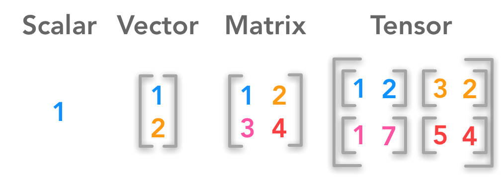

# tensorflow

tensorflow 2.0 example을 실행시키면서 tensorflow와 keras를 이해하자

# tensorflow란??

딥러닝 프로그램을 쉽게 구현할 수 있도록 전부 완성시켜놓은 라이브러리이며 python에 최적화 되어있다.

## tensor란??

- tensor(텐서)란 새로운 데이터 표현 방식
- 3차원 배열

## flow란??

Graph라는 개념을 가지고 있고 Graph는 Node들로 구성되어져 있다. 

즉, TensorFlow는 Node들을 어떠한 연산이라고 하면 입력(Tensor)이 들어갈때 각 노드를 거쳐서 출력을 만들어내는 Graph다.

# keras란??

쉽게 개발하고 활용하는데 초점을 맞춘 딥러닝 라이브러리

## 특징
- 편리함
- 모듈성
- 확장성
- pyhton

## 구성
- 데이터셋 만들기
- 모델 만들기
- 학습 설정하기 : `model.complie()`
- 학습하기 : `model.fit()`
- 검증하기 : `model.evalution()`
- 사용하기 : `model.predict()`

# 각종 예제를 실행시켜보자!!
- [GO](https://www.tensorflow.org/tutorials/quickstart/beginner?hl=ko)

# REFERENCE
- [https://www.tensorflow.org/tutorials/quickstart/beginner?hl=ko](https://www.tensorflow.org/tutorials/quickstart/beginner?hl=ko)
- [https://github.com/jeonggunlee/OpenSourceKeras](https://github.com/jeonggunlee/OpenSourceKeras)
